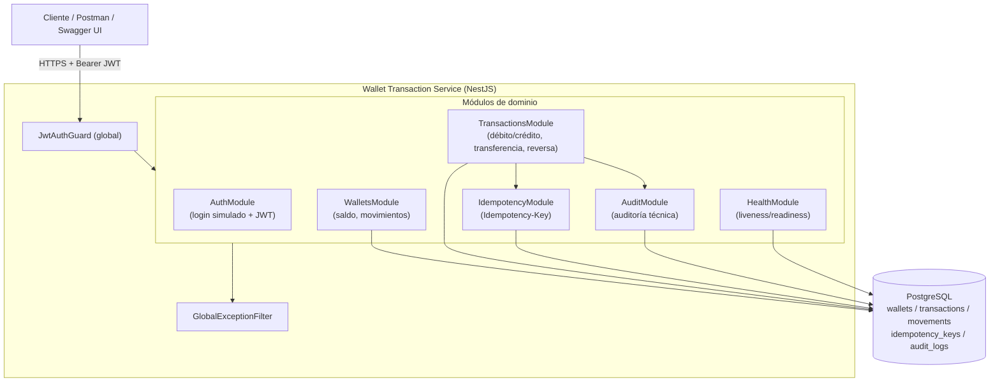
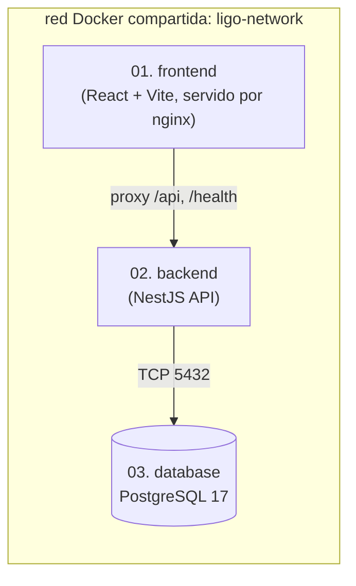

# Arquitectura — Wallet Transaction Service

## Vista general

## Decisiones clave

### 1. Modelo de datos (double-entry ledger)

- **`wallets`**: saldo disponible (`numeric(18,2)`), moneda y estado (`ACTIVE`/`BLOCKED`/`CLOSED`).
- **`transactions`**: representa la *operación* de negocio (DEBIT, CREDIT, TRANSFER, REVERSAL) con su estado (`PENDING`/`COMPLETED`/`FAILED`/`REVERSED`).
- **`movements`**: el *asiento contable* (ledger entry). Un débito/crédito simple genera 1 movimiento; una transferencia genera 2 (débito en origen, crédito en destino) enlazados por `transactionId`, implementando doble partida contable real.
- **`idempotency_keys`**: una fila por `(idempotencyKey, endpoint)`, con el hash del payload y la respuesta cacheada.
- **`audit_logs`**: rastro técnico mínimo de toda operación crítica (quién, qué, cuándo, metadata).

Los montos **nunca** se representan como `float`: se almacenan como `numeric(18,2)` en PostgreSQL y se transportan como `string` en la API. Toda aritmética usa `decimal.js` (ver `src/common/utils/money.util.ts`) para evitar errores de redondeo IEEE-754.

### 2. Atomicidad y consistencia

Cada operación crítica (`POST /transactions`, `POST /transactions/transfer`, `POST /transactions/reversal`) se ejecuta dentro de **una única transacción de base de datos** (`QueryRunner` con `START TRANSACTION`). Si cualquier paso falla, se hace `ROLLBACK` completo: ni el saldo, ni el movimiento, ni el registro de idempotencia ni la auditoría quedan escritos parcialmente.

**Concurrencia**: antes de leer/mutar un saldo se bloquea la fila del wallet con `SELECT ... FOR UPDATE` (`pessimistic_write`). En transferencias, ambos wallets se bloquean en un **orden determinístico** (por `id` ascendente) para evitar *deadlocks* entre transferencias cruzadas concurrentes.

### 3. Idempotencia

El header `Idempotency-Key` es obligatorio en toda operación crítica. `IdempotencyService.run(...)` inserta un registro `(idempotencyKey, endpoint)` **dentro de la misma transacción** que la lógica de negocio:

- Si la clave no existe → se procesa la operación y se persiste la respuesta junto con el efecto de negocio, de forma atómica.
- Si la clave ya existe con el **mismo** hash de payload → se devuelve la respuesta cacheada sin reprocesar (idempotencia real).
- Si la clave ya existe con **distinto** payload → `409 Conflict`.
- Si la clave está `PROCESSING` (petición concurrente en curso) → `409 Conflict`.
- Si la operación de negocio falla, el `ROLLBACK` también revierte el registro de idempotencia, dejando la clave libre para un reintento legítimo.

### 4. Reversas

Una reversa **no** modifica la transacción original in-place; crea una **nueva transacción** de tipo `REVERSAL` con los movimientos inversos, y marca la original como `REVERSED` mediante `reversedByTransactionId`. Esto preserva el historial completo (auditable) y garantiza que una transacción reversada no pueda reversarse nuevamente (`409 Conflict`) ni que una reversa pueda volver a reversarse (`422`).

### 5. Seguridad

- Login simulado que firma un JWT real (HS256) sobre credenciales mock validadas con comparación de tiempo constante (`crypto.timingSafeEqual`).
- `JwtAuthGuard` global; rutas públicas explícitas vía `@Public()` (login, health checks, Swagger).
- **Autorización por propiedad de wallet** (`WalletAccessService`): el JWT lleva `role` (`ADMIN`/`CUSTOMER`) y `ownerName`. `ADMIN` (cuenta de backoffice, `senior.backend`) opera cualquier wallet; `CUSTOMER` (cuenta demo `juan.perez`, ligada al `ownerName` "Juan Perez") solo puede operar wallets cuyo `ownerName` coincide, y recibe `403 Forbidden` en caso contrario. Se aplica en balance, movimientos, débito/crédito, el lado origen de una transferencia y la reversa.
- Validación estricta de DTOs con `class-validator` (`whitelist`, `forbidNonWhitelisted`).
- Filtro de excepciones centralizado: nunca expone stack traces; solo se loguean server-side.
- `LoggingInterceptor` redacta campos sensibles (`password`, `token`, `authorization`, etc.) antes de loguear.
- `helmet` habilitado, variables sensibles solo por entorno (`.env`, nunca hardcodeadas).

### 6. Convención REST: query param en lecturas, body param en escrituras

Todas las rutas `GET` reciben el identificador del recurso como **query param** (`?walletId=...`,
`?transactionId=...`), nunca como path param; todas las rutas `POST`/`PUT`/`PATCH`/`DELETE` reciben
identificadores y campos exclusivamente en el **body** JSON. Esto es deliberado y consistente en toda la
API:

| Verbo | Endpoint | Identificador |
|---|---|---|
| `GET` | `/wallets/list` | — (filtra por rol: ADMIN ve todas, CUSTOMER solo las propias) |
| `GET` | `/wallets/balance?walletId=wal_001` | query param |
| `GET` | `/wallets/movements?walletId=wal_001&type=&status=&page=&pageSize=` | query param |
| `POST` | `/transactions` | `walletId` en el body |
| `POST` | `/transactions/transfer` | `sourceWalletId`/`targetWalletId` en el body |
| `POST` | `/transactions/reversal` | `transactionId` en el body |
| `GET` | `/transactions/status?transactionId=txn_001` | query param |

No existen rutas `PUT`/`PATCH`/`DELETE`: el ledger de transacciones es **inmutable** (append-only) por
requisitos de auditoría y de durabilidad ACID — una transacción nunca se edita ni se borra físicamente,
solo se compensa creando una nueva transacción `REVERSAL` (`POST`, porque crea un recurso nuevo). Modelar
el "deshacer" como una creación en vez de un borrado es el uso correcto del verbo para un dominio de
ledger financiero regulado.

### 6.1. Patrones de diseño, SOLID, herencia/polimorfismo y ACID

Cada patrón/principio aplicado está documentado **directamente en el código fuente**, junto a la clase que
lo implementa (no solo aquí). Resumen y ubicación:

| Patrón / Principio | Dónde | Cómo |
|---|---|---|
| Template Method | `TransactionsService.withTransaction`, `IdempotencyService.run` | Fijan el esqueleto invariante (begin/commit/rollback; check-then-execute-then-record) y delegan la parte variable a un callback |
| Facade | `TransactionsService` | Punto de entrada único que orquesta `IdempotencyService`, `AuditService`, `WalletAccessService` y el `DataSource` |
| Strategy | `WalletAccessService` | Política de autorización intercambiable, inyectada por constructor |
| Value Object (DDD) | `Money` (`common/utils/money.util.ts`) | Envoltorio inmutable sobre `decimal.js`; evita "primitive obsession" con montos |
| Chain of Responsibility / Front Controller | `JwtAuthGuard`, `GlobalExceptionFilter` | Guard global y filtro global únicos en el pipeline de cada request |
| Decorator (estructural) | `LoggingInterceptor` | Envuelve el `Observable` del handler con logging, sin que el handler lo sepa |
| Herencia + Polimorfismo | `business.exceptions.ts` (`BusinessRuleException extends HttpException`) | Todas las excepciones de negocio heredan la forma común (422); `GlobalExceptionFilter` las trata polimórficamente vía `instanceof HttpException`, sin conocer las subclases concretas (Liskov Substitution) |
| SOLID — SRP | Controllers vs. Services | Los controllers solo manejan HTTP; los services solo manejan reglas de negocio |
| SOLID — OCP | `business.exceptions.ts`, `WalletAccessService` | Nuevas excepciones/roles se agregan extendiendo, sin modificar el filtro/las políticas existentes |
| SOLID — DIP | Todos los `constructor(private readonly ...)` | Las clases dependen de abstracciones inyectadas por Nest, nunca instancian sus colaboradores |
| ACID | `TransactionsService.withTransaction` | Atomicidad (commit/rollback), Consistencia (validaciones + constraints), Aislamiento (`READ COMMITTED` + `pessimistic_write`), Durabilidad (WAL de PostgreSQL) |

### 7. Códigos de estado HTTP

| Código | Significado en este servicio |
|---|---|
| 400 | Validación de DTO o header `Idempotency-Key` faltante/ inválido |
| 401 | JWT ausente/ inválido/expirado, o credenciales de login inválidas |
| 403 | El wallet solicitado no pertenece al usuario autenticado (rol `CUSTOMER`, ver `WalletAccessService`) |
| 404 | Wallet o transacción no encontrada |
| 409 | Conflicto de `Idempotency-Key`, o intento de reversar una transacción ya reversada |
| 422 | Regla de negocio violada (wallet inactiva, fondos insuficientes, monedas distintas, transacción no reversable) |
| 500 | Error inesperado (nunca expone detalles internos) |

### 8. Por qué NestJS + TypeORM

NestJS aporta una arquitectura modular por capas (Controller → Service → Repository) con inyección de dependencias, guards, pipes e interceptors nativos, ideal para aplicar Clean Code y separar responsabilidades. TypeORM permite migraciones versionadas explícitas (requisito del challenge) y control fino sobre transacciones (`QueryRunner`) necesario para el bloqueo pesimista de filas.

### 9. Despliegue en 3 capas independientes

El repositorio está organizado en `01. frontend`, `02. backend` y `03. database`, cada una con su propio
`build.bat` y `deploy.bat`, sin depender de un único `docker-compose` orquestador. Un `build.bat`/
`deploy.bat` en la raíz del repositorio actúa como dispatcher unificado
(`deploy.bat database|backend|frontend|all`), delegando en el script de la carpeta correspondiente.

Separación estricta de responsabilidades entre ambos scripts, en las tres capas:

- **`build.bat`** compila **dentro de Docker** (build multi-stage del `Dockerfile` de cada capa: etapa
  `builder` con `npm ci` + compilación) y produce la imagen local lista para desplegar. No depende del
  Node/npm del host, garantizando que la compilación siempre ocurre en el mismo entorno que correrá en
  producción. Las imágenes finales (`production`) **no contienen código fuente**, solo los artefactos
  compilados (`dist/` en el backend, estáticos en el frontend).
- **`deploy.bat`** **solo despliega**: crea la red, el contenedor y lo publica, pero nunca reconstruye a
  partir del código fuente. Si la imagen todavía no existe la construye una única vez delegando en
  `build.bat`.

- **`03. database`** es la fuente de verdad del esquema: una imagen Docker propia
  (`ligo-wallet-postgres:17`, ver `03. database/Dockerfile`) que extiende `postgres:17` horneando los
  scripts `init/001_schema.sql` y `init/002_seed.sql` dentro de `docker-entrypoint-initdb.d` en tiempo de
  build (no por bind-mount en tiempo de despliegue), igual que el backend y el frontend construyen su
  propia imagen local. Esos scripts también pre-insertan las migraciones de TypeORM en la tabla
  `migrations`, de modo que si el backend llega a ejecutar sus propias migraciones contra esa misma base
  de datos (por ejemplo en un entorno donde se despliega solo el backend contra un Postgres vacío) no
  intenta recrear tablas ya existentes: ambos caminos (SQL directo o TypeORM) son compatibles y no
  colisionan. `deploy.bat database` es **idempotente**: en cada ejecución elimina el contenedor y el
  volumen de datos previos y levanta uno nuevo desde la imagen, garantizando siempre el mismo estado
  inicial (esquema + seed).
- **`02. backend`** espera activamente (TCP polling) a que PostgreSQL esté disponible antes de aplicar
  migraciones y arrancar, para tolerar que las capas se desplieguen en cualquier orden.
- **`01. frontend`** se sirve como estáticos vía nginx, que además actúa de reverse proxy de `/api/*` y
  `/health` hacia el contenedor del backend (por nombre, en la red compartida), evitando problemas de CORS
  en el navegador.
- Las tres capas se conectan mediante una red Docker (`ligo-network`) creada automáticamente por los
  propios scripts `deploy.bat` si no existe, simulando el patrón de despliegue independiente por
  microservicio (cada capa con su propio ciclo de compilación/despliegue) sin acoplar sus pipelines.

### 10. Zona horaria y sincronización horaria (America/Lima)

Tanto la base de datos como el backend fijan explícitamente su zona horaria en **America/Lima (UTC-5)**,
para que `now()`, `CURRENT_DATE`, los timestamps de auditoría y los logs reflejen la hora real de Perú en
lugar de UTC o la hora del host:

- **`03. database`**: la imagen fija `TZ=America/Lima` a nivel de sistema operativo, y
  `03. database/deploy.bat` arranca PostgreSQL con `-c timezone=America/Lima -c log_timezone=America/Lima`,
  por lo que el GUC `timezone` del servidor (no solo del cliente) queda fijado independientemente de quién
  se conecte.
- **`02. backend`**: la imagen instala `tzdata` (Alpine no la trae por defecto) y fija `TZ=America/Lima`
  tanto en build como en runtime (`deploy.bat` inyecta `-e TZ=America/Lima`), de modo que `Date`, los logs
  de Nest y cualquier formateo de fecha en Node usan la hora de Lima.

**Sincronización horaria activa (NTP):** los contenedores Docker comparten el reloj del kernel del
host/VM, por lo que no tienen un reloj de hardware propio; para blindar a la base de datos contra un
eventual *drift* del reloj (por ejemplo tras suspender/reanudar la máquina o la VM de Docker Desktop), la
imagen `03. database` instala **chrony** y lo arranca desde
`03. database/docker-entrypoint-wrapper.sh` (que envuelve al entrypoint oficial de PostgreSQL):

1. Hace un ajuste inmediato del reloj (`chronyd -q`) contra servidores NTP públicos antes de iniciar
   PostgreSQL.
2. Deja `chronyd` corriendo en segundo plano durante toda la vida del contenedor para mantenerlo
   sincronizado ("siempre al día").
3. Requiere el flag `--cap-add=SYS_TIME` en `docker run` (ya incluido en `deploy.bat`); si el host no lo
   otorga, ambos pasos se degradan de forma segura (solo advierten) sin impedir el arranque de la base de
   datos.

Verificación rápida ya validada en este entorno: `docker exec ligo-wallet-postgres chronyc tracking` /
`chronyc sources` muestran sincronización activa contra `pool.ntp.org`, y `SHOW timezone;` /
`SELECT now();` devuelven `America/Lima` con el offset `-05` correcto.

### 11. Cobertura de pruebas de las reglas de negocio críticas

Cada regla de negocio crítica exigida por el challenge tiene al menos: (a) un test unitario (mocks, rápido,
`02. backend/src/**/*.spec.ts`), (b) un test de integración end-to-end contra PostgreSQL real
(`02. backend/test/integration/*.e2e-spec.ts`), y (c) un request de Postman con un script `pm.test`
ejecutable (no solo inspección manual) en `04. Entregables/postman/Ligo-Wallet-Service.postman_collection.json`,
carpetas **"Reglas de negocio - Wallet"** y **"Reglas de negocio - Transacciones (atomicidad e idempotencia)"`.

**109 tests automatizados en verde** (64 unitarios + 45 e2e, ejecutados contra PostgreSQL 17 real en este
entorno: `npm test` y `npm run test:e2e` dentro de `02. backend`). Los 64 unitarios incluyen 18 tests de
**validación de DTOs** (`class-validator`, ejecutados sin bootstrap de Nest ni HTTP) que cierran
explícitamente el requisito de "Testing Pyramid" del challenge: reglas de negocio, validaciones e
idempotencia, cada una con su propio unit test dedicado.

| Regla de negocio crítica | Test unitario | Test e2e (Postgres real) | Request Postman |
|---|---|---|---|
| Solo wallets `ACTIVE` pueden operar | `transactions.service.spec.ts` → *throws WalletNotActiveException for a blocked wallet* | `transactions.e2e-spec.ts` → *rejects operations on a blocked wallet with 422*; `transfer.e2e-spec.ts` → *rejects a transfer when the target wallet is blocked* | `[Wallet] Solo ACTIVE puede operar...` (422), `[Transfer] Wallet destino bloqueada` (422) |
| No se permite saldo negativo | `transactions.service.spec.ts` → *throws InsufficientFundsException and does not mutate the balance* | `transactions.e2e-spec.ts` → *rejects a debit with insufficient funds (422)*; `transfer.e2e-spec.ts` → *rejects a transfer with insufficient funds* | `[Wallet] No se permite saldo negativo...` (422), `[Transfer] Fondos insuficientes...` (422) |
| No se permite operar con monedas distintas | `transactions.service.spec.ts` → *throws CurrencyMismatchException when currencies differ* | `transactions.e2e-spec.ts` → *returns 422 when the currency does not match*; `transfer.e2e-spec.ts` → *rejects a transfer between wallets with different currencies* | `[Wallet] No se permite operar con monedas distintas...` (422), `[Transfer] Monedas distintas...` (422) |
| Montos como decimal/string; nunca float | `money.util.spec.ts` (validación de formato); DTO `IsMoneyAmount` | `transactions.e2e-spec.ts` → *returns 400 for an invalid money amount format* (3 decimales) | `[Wallet] Montos siempre decimal/string, nunca float...` (400) |
| Saldo disponible se actualiza dentro de la misma transacción | `transactions.service.spec.ts` → *debits/credits a wallet and persists the resulting balance*, *rolls back the transaction when the business logic fails* | `transactions.e2e-spec.ts` → *processes a successful debit/credit ... updates the balance atomically* | `Create debit`, `Create credit` |
| Toda operación crítica debe ser atómica | `transactions.service.spec.ts` → *moves funds from source to target atomically* (ver `withTransaction`, comentado con las 4 garantías ACID) | `transfer.e2e-spec.ts` → *transfers funds between two wallets with a double-entry ledger* | `Transfer between wallets` |
| Si una parte falla, debe ejecutarse rollback | `transactions.service.spec.ts` → *rolls back the transaction when the business logic fails*; *rejects a transfer with insufficient funds and leaves both balances untouched* | `transfer.e2e-spec.ts` → *rejects a transfer with insufficient funds and leaves both balances untouched* | (verificado por los mismos requests 422 de arriba: el balance no cambia) |
| La misma Idempotency-Key debe devolver la misma respuesta | `idempotency.service.spec.ts` → *replays the stored response without re-executing the handler* | `transactions.e2e-spec.ts` / `transfer.e2e-spec.ts` / `reversal.e2e-spec.ts` → *replays the exact same response when the same Idempotency-Key is retried* | `[Idempotencia] Primera llamada...` + `[Idempotencia] Misma Idempotency-Key + mismo body -> misma respuesta exacta` |
| Misma Idempotency-Key con body diferente debe responder conflicto | `idempotency.service.spec.ts` → *throws a conflict when the same key is reused with a different payload* | `transactions.e2e-spec.ts` → *returns 409 when the same Idempotency-Key is reused with a different payload* | `[Idempotencia] Misma Idempotency-Key + body DISTINTO -> conflicto` (409) |
| Una transacción reversada no puede reversarse nuevamente | `transactions.service.spec.ts` → *throws TransactionAlreadyReversedException on double reversal*; *throws TransactionNotReversibleException when reversing a REVERSAL* | `reversal.e2e-spec.ts` → *rejects reversing the same transaction twice with 409*; *returns 422 when trying to reverse a reversal itself* | `[Transacciones] Una transacción reversada no puede reversarse de nuevo` (409), `[Transacciones] Una reversa no puede reversarse a si misma` (422) |
| Toda operación crítica debe dejar auditoría | *(nuevo)* `transactions.e2e-spec.ts` → *leaves an audit trail entry for every critical (balance-affecting) operation* (verifica directamente la fila insertada en `audit_logs` vía `AuditService.record`, ejecutado dentro de la misma transacción — ver §2/ACID) | mismo test anterior (es e2e) | *(no expuesto por API por diseño; se verifica a nivel de base de datos en el test e2e citado, evitando exponer un endpoint de auditoría sin necesidad real del challenge)* |

Adicionalmente, el mismo mecanismo de tests cubre reglas de seguridad transversales (401/403) y casos límite
(404 wallet/transacción inexistente, 400 payloads inválidos), documentados en la sección 5 y en las carpetas
`Auth`, `Wallets` y `Transactions` de la colección Postman.

Durante la elaboración de esta cobertura se detectó y corrigió un bug real preexistente en
`IdempotencyService.run()`: al colisionar dos requests con la misma `Idempotency-Key`, el `INSERT` fallaba
correctamente por restricción única, pero la lectura del registro existente (`resolveExistingRecord`) se
ejecutaba dentro de la MISMA transacción que PostgreSQL ya había abortado por ese error, provocando un fallo
en cascada (`current transaction is aborted`). La corrección envuelve el intento de inserción en un
`SAVEPOINT` (transacción anidada de TypeORM), de forma que solo esa sentencia se revierte y la transacción de
negocio sigue siendo utilizable para leer y reproducir la respuesta original — una aplicación directa de
Isolation (ACID) a nivel de sentencia individual.
