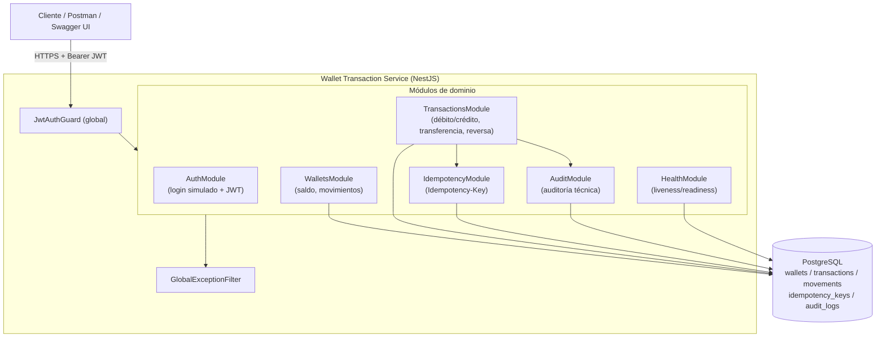

# Arquitectura — Wallet Transaction Service

## Vista general

## Decisiones clave

### 1. Modelo de datos (double-entry ledger)

- **`wallets`**: saldo disponible (`numeric(18,2)`), moneda y estado (`ACTIVE`/`BLOCKED`/`CLOSED`).
- **`transactions`**: representa la *operación* de negocio (DEBIT, CREDIT, TRANSFER, REVERSAL) con su estado (`PENDING`/`COMPLETED`/`FAILED`/`REVERSED`).
- **`movements`**: el *asiento contable* (ledger entry). Un débito/crédito simple genera 1 movimiento; una transferencia genera 2 (débito en origen, crédito en destino) enlazados por `transactionId`, implementando doble partida contable real.
- **`idempotency_keys`**: una fila por `(idempotencyKey, endpoint)`, con el hash del payload y la respuesta cacheada.
- **`audit_logs`**: rastro técnico mínimo de toda operación crítica (quién, qué, cuándo, metadata).

Los montos **nunca** se representan como `float`: se almacenan como `numeric(18,2)` en PostgreSQL y se transportan como `string` en la API. Toda aritmética usa `decimal.js` (ver `src/common/utils/money.util.ts`) para evitar errores de redondeo IEEE-754.

### 2. Atomicidad y consistencia

Cada operación crítica (`POST /transactions`, `POST /transactions/transfer`, `POST /transactions/:id/reversal`) se ejecuta dentro de **una única transacción de base de datos** (`QueryRunner` con `START TRANSACTION`). Si cualquier paso falla, se hace `ROLLBACK` completo: ni el saldo, ni el movimiento, ni el registro de idempotencia ni la auditoría quedan escritos parcialmente.

**Concurrencia**: antes de leer/mutar un saldo se bloquea la fila del wallet con `SELECT ... FOR UPDATE` (`pessimistic_write`). En transferencias, ambos wallets se bloquean en un **orden determinístico** (por `id` ascendente) para evitar *deadlocks* entre transferencias cruzadas concurrentes.

### 3. Idempotencia

El header `Idempotency-Key` es obligatorio en toda operación crítica. `IdempotencyService.run(...)` inserta un registro `(idempotencyKey, endpoint)` **dentro de la misma transacción** que la lógica de negocio:

- Si la clave no existe → se procesa la operación y se persiste la respuesta junto con el efecto de negocio, de forma atómica.
- Si la clave ya existe con el **mismo** hash de payload → se devuelve la respuesta cacheada sin reprocesar (idempotencia real).
- Si la clave ya existe con **distinto** payload → `409 Conflict`.
- Si la clave está `PROCESSING` (petición concurrente en curso) → `409 Conflict`.
- Si la operación de negocio falla, el `ROLLBACK` también revierte el registro de idempotencia, dejando la clave libre para un reintento legítimo.

### 4. Reversas

Una reversa **no** modifica la transacción original in-place; crea una **nueva transacción** de tipo `REVERSAL` con los movimientos inversos, y marca la original como `REVERSED` mediante `reversedByTransactionId`. Esto preserva el historial completo (auditable) y garantiza que una transacción reversada no pueda reversarse nuevamente (`409 Conflict`) ni que una reversa pueda volver a reversarse (`422`).

### 5. Seguridad

- Login simulado que firma un JWT real (HS256) sobre credenciales mock validadas con comparación de tiempo constante (`crypto.timingSafeEqual`).
- `JwtAuthGuard` global; rutas públicas explícitas vía `@Public()` (login, health checks, Swagger).
- Validación estricta de DTOs con `class-validator` (`whitelist`, `forbidNonWhitelisted`).
- Filtro de excepciones centralizado: nunca expone stack traces; solo se loguean server-side.
- `LoggingInterceptor` redacta campos sensibles (`password`, `token`, `authorization`, etc.) antes de loguear.
- `helmet` habilitado, variables sensibles solo por entorno (`.env`, nunca hardcodeadas).

### 6. Códigos de estado HTTP

| Código | Significado en este servicio |
|---|---|
| 400 | Validación de DTO o header `Idempotency-Key` faltante/ inválido |
| 401 | JWT ausente/ inválido/expirado, o credenciales de login inválidas |
| 403 | Reservado para autorización por rol/alcance (extensible vía guards) |
| 404 | Wallet o transacción no encontrada |
| 409 | Conflicto de `Idempotency-Key`, o intento de reversar una transacción ya reversada |
| 422 | Regla de negocio violada (wallet inactiva, fondos insuficientes, monedas distintas, transacción no reversable) |
| 500 | Error inesperado (nunca expone detalles internos) |

### 7. Por qué NestJS + TypeORM

NestJS aporta una arquitectura modular por capas (Controller → Service → Repository) con inyección de dependencias, guards, pipes e interceptors nativos, ideal para aplicar Clean Code y separar responsabilidades. TypeORM permite migraciones versionadas explícitas (requisito del challenge) y control fino sobre transacciones (`QueryRunner`) necesario para el bloqueo pesimista de filas.
